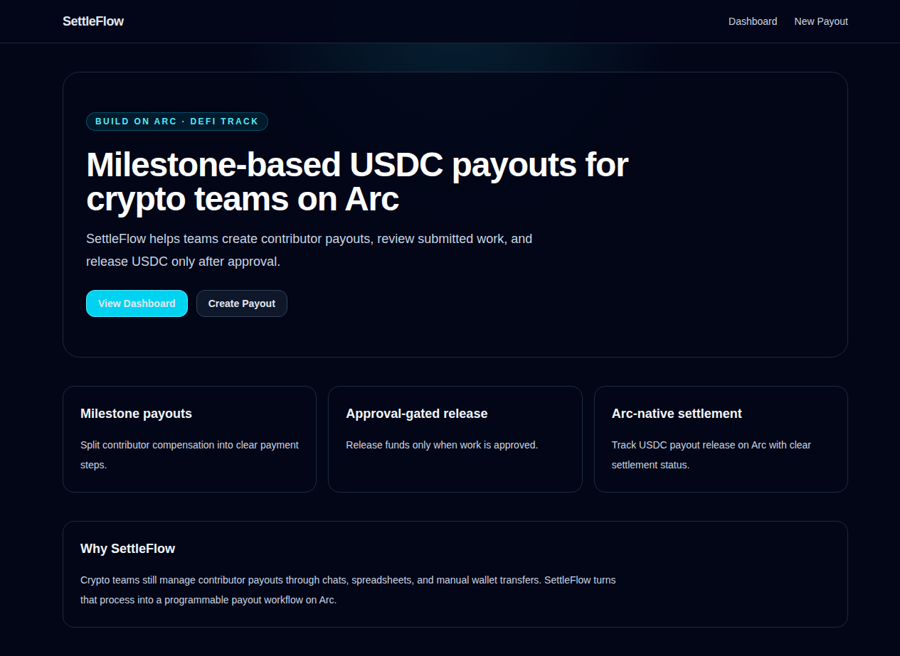
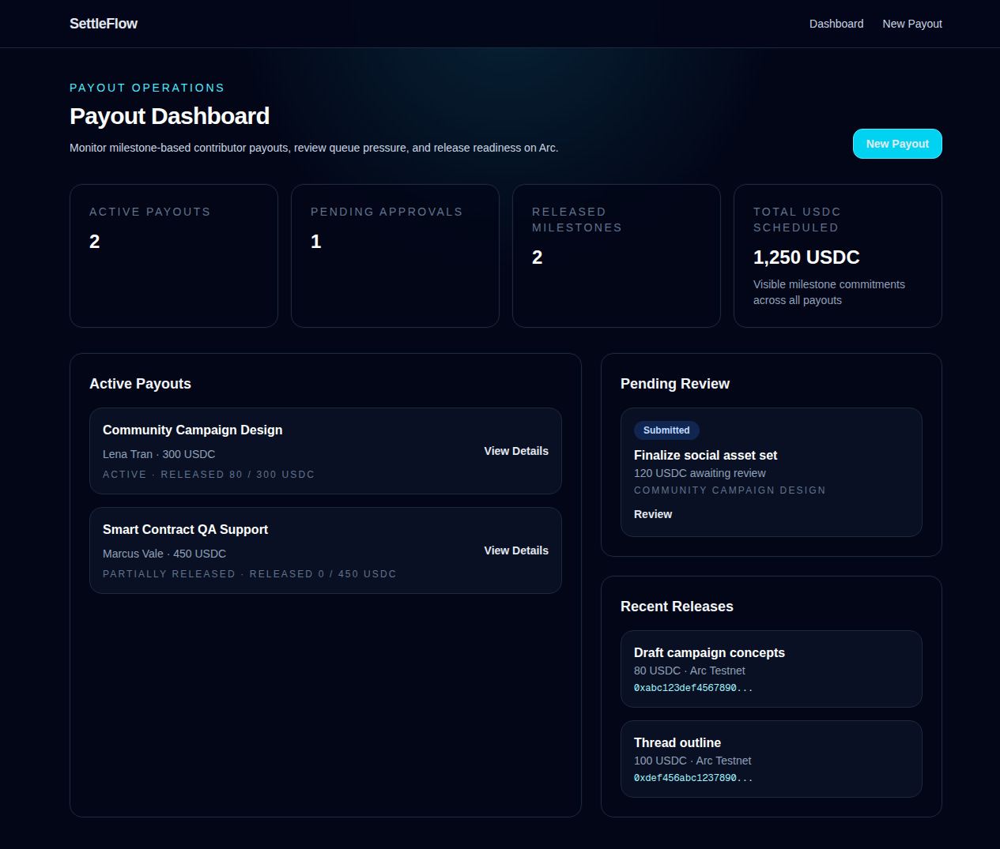
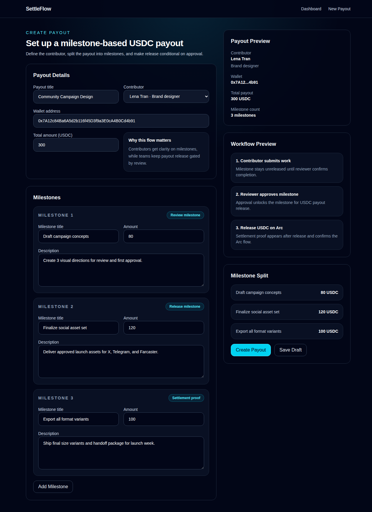
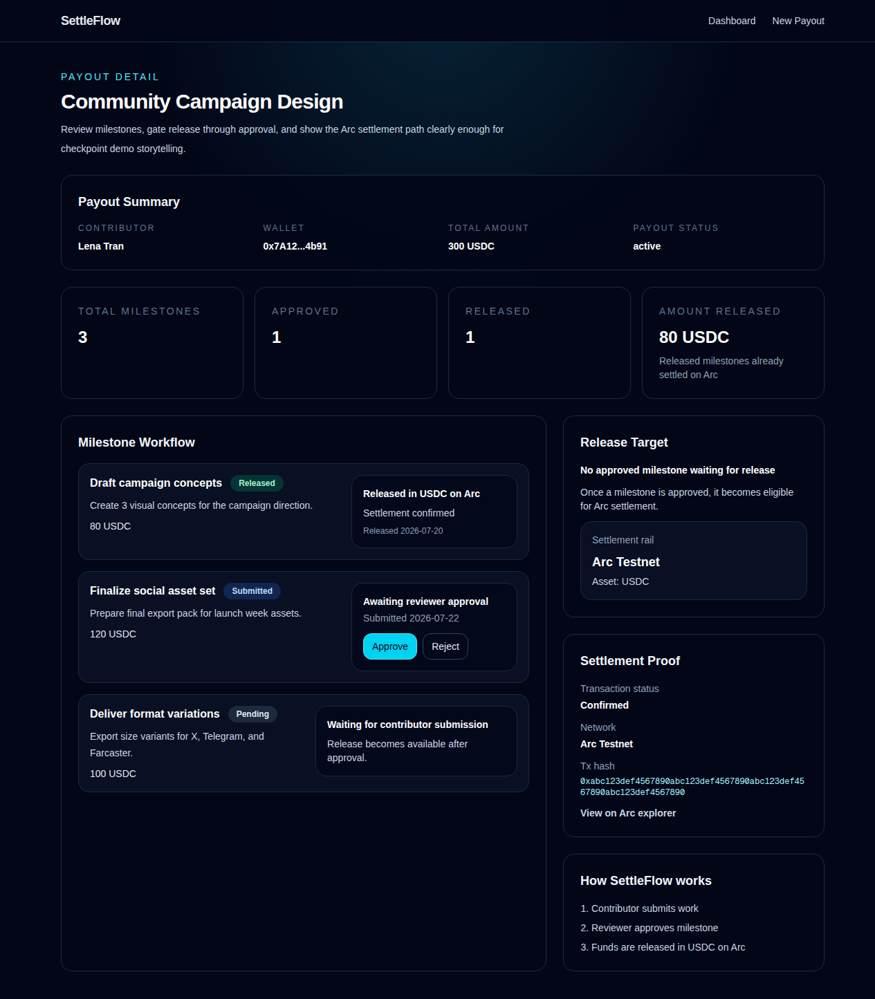

# SettleFlow

**Arc-native USDC payout workflow for crypto teams.**

For the current documentation reading order, start with `docs/README.md`.

SettleFlow helps crypto teams create milestone-based contributor payouts, review submitted work, and release USDC only after approval. Instead of ad hoc wallet transfers, SettleFlow turns contributor compensation into a programmable settlement workflow on Arc.

## Problem

Crypto teams often manage contributor payments through chats, spreadsheets, and manual wallet transfers. This creates poor visibility, inconsistent approval flow, and weak control over when funds should actually be released.

## Solution

SettleFlow turns contributor compensation into a milestone-based payout workflow on Arc:
- create contributor payouts in USDC
- split work into milestones
- review submitted work
- release funds only after approval
- track settlement status transparently

## Why Arc

SettleFlow is built around Arc because the product depends on stablecoin-native settlement.
- **Arc** acts as the settlement rail
- **USDC** is the core payment and settlement layer
- **App Kit Send** is the intended payout execution path

This makes contributor payouts more legible, controllable, and onchain-native than manual wallet transfers.

## Current Repository State

The repository currently includes:
- landing page for product framing
- dashboard route for payout operations visibility
- payout creation route backed by repository/API flow
- payout detail route with review, release, retry, and settlement proof surfaces
- reusable milestone, proof, stat, and section components
- database-backed payout, milestone, release, and proof workflow
- API routes for payout creation, activation, milestone review, release, proof refresh, and retry
- Arc integration scaffold under `lib/arc/` with execution-mode plumbing and a real-adapter boundary

Current implementation state:
- product is being advanced as a real MVP, not a demo artifact
- persistence and mutation flow now exist in the repository
- auth/session is still incomplete and remains a major gap
- some legacy mock/demo artifacts and wording still need cleanup
- Arc payment execution boundary exists, but production-safe live release execution is not yet fully verified against official Arc requirements

## MVP Scope

The MVP focuses on one core workflow:
1. Create a payout
2. Define milestones
3. Track contributor submission state
4. Approve or reject milestone completion
5. Release USDC payout
6. Show settlement status / transaction proof

## Current Progress

- Product direction finalized around milestone-based contributor payouts
- MVP scope narrowed toward a real usable product surface
- Repository structure and implementation plan established
- Core payout workflow now has repository/API-backed mutation paths
- Permission boundary V1 and mutation contract hardening are in progress
- Arc integration scaffold and release execution boundary are in place

## Verified Checkpoint 2 State

Verified routes:
- `/`
- `/dashboard`
- `/payouts/new`
- `/payouts/payout-detail`

Verified checks:
- `npm run build` completed successfully
- key routes are implemented in the repository
- invalid legacy payout routes return `404`
- checkpoint UI flow is present across landing, dashboard, payout creation, and payout detail views
- payout detail release/proof state stays synchronized and persists across reloads in demo-safe mode

## Checkpoint 2 Screens

### Landing page
*Product framing for milestone-based contributor payouts on Arc.*

### Dashboard
*Payout visibility, review queue, and release status.*

### Payout creation
*Define contributor scope, milestone split, and payout structure.*

### Payout detail
*Review milestones, gate release, and show settlement proof.*

## Planned Stack

- **Frontend:** Next.js
- **Language:** TypeScript
- **Styling:** Tailwind CSS
- **Data layer:** PostgreSQL + Prisma-backed application state
- **Blockchain target:** Arc Testnet
- **Money layer:** USDC
- **Payments integration:** App Kit Send

## Repository Structure

- `app/` — app routes and pages
- `components/` — reusable UI components
- `lib/` — models, mock data, Arc helpers, utilities
- `docs/` — canonical product, architecture, conventions, current state, and checkpoint docs
- `public/` — static assets

## Roadmap

### Checkpoint 2
- repository link
- progress summary
- working UI flow for milestone payouts
- integration-ready Arc payment architecture

### Final Submission
- functional MVP deployed on Arc
- public code repository
- 3-minute video pitch + demo
- submission deck

## Track

- **Build on Arc — Overview**
- **DeFi Track**
